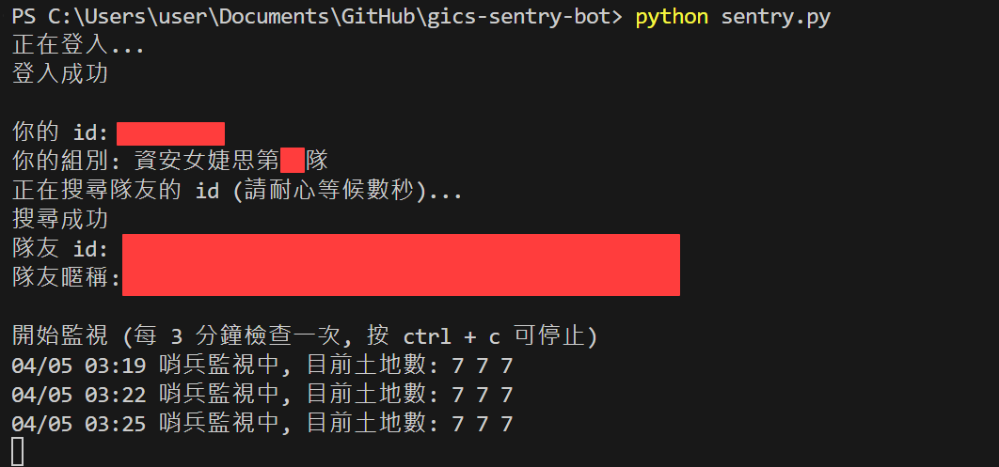

# GiCS 初賽哨兵 bot

## 2025 更新中，目前可使用 2024 版本，請見 Release 頁面

這是一個被資安女婕思長達五天的初賽催生出的小工具

每三分鐘檢查隊伍每個人的土地數量，地數掉的時候播音樂通知，讓你的隊友可以安心睡覺 :sparkles:




## 安裝
請用 [Python 3](https://www.python.org/downloads/) 以上

在 [Release 頁面](https://github.com/idkidkidkidkidkidkidkidk/gics-sentry-bot/releases/tag/v1.0) 下載 
gics_sentry_bot_v1.0.zip，解壓縮後執行指令，安裝需要的套件

```shell
pip install -r requirements.txt
```


## 使用
```shell
# 測試音量
python alarm.py

# 在 .env 中填入競賽用的帳號密碼後再執行哨兵 bot
# 執行哨兵 bot
python sentry.py
```

也可指定額外設定
```shell
# 可以填入用其他 mp3 檔案替換掉 alarm.mp3
python sentry.py --music_path /path/to/my_alarm.mp3

# 關閉程式異常（例如網路斷線）時播放警報音樂的功能
python sentry.py --silent_on_error
```


## 注意事項
- 啟動 bot 之前請先使用 alarm.py 測試音量，避免太小聲或太大聲
- 建議檢查電腦在掛機一段時間後會不會休眠，休眠很可能導致哨兵 bot 停止運作


## Known Issues
1. 土地被打掉時才會告警，被攻擊但土地還沒被打掉時不會發出警報
2. 警報音樂播放時不會同時偵測攻擊


## Notes
預計在初賽開始後一天內 release，出問題的話歡迎開 issue


## Todo
- [x] 警報音樂改成只播一分鐘，避免影響偵測
- [ ] 替換警報時的動作，無縫接軌 Discord bot 等等


## Credits
alarm.mp3 來源：Different Heaven - Nekozilla [NCS Release]

Music provided by NoCopyrightSounds

Free Download/Stream: http://ncs.io/nekozilla

Watch: http://youtu.be/6FNHe3kf8_s
