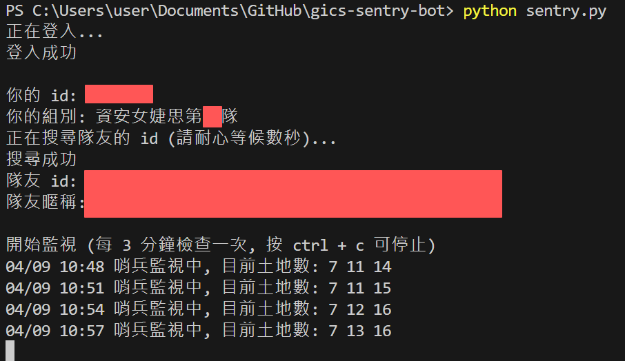
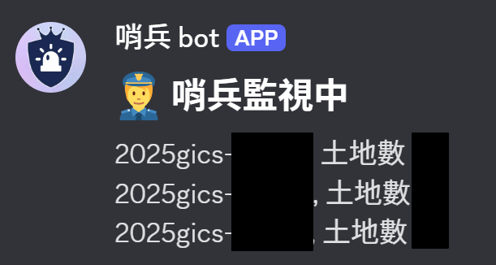
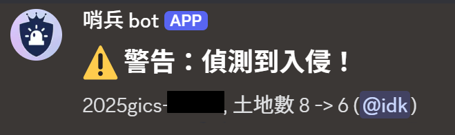
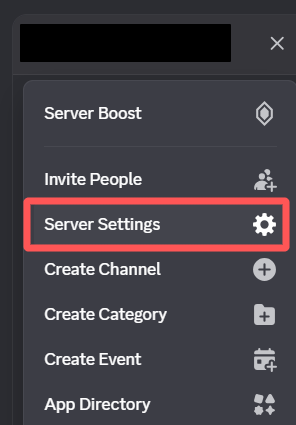
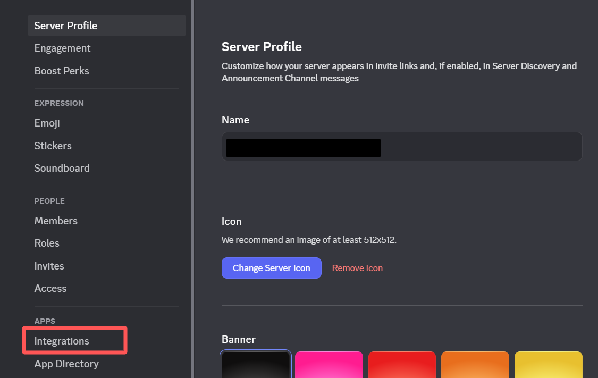
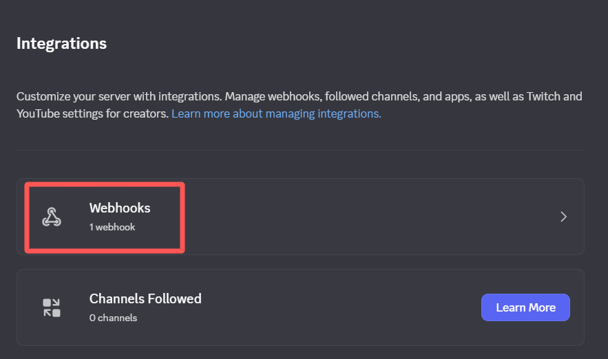
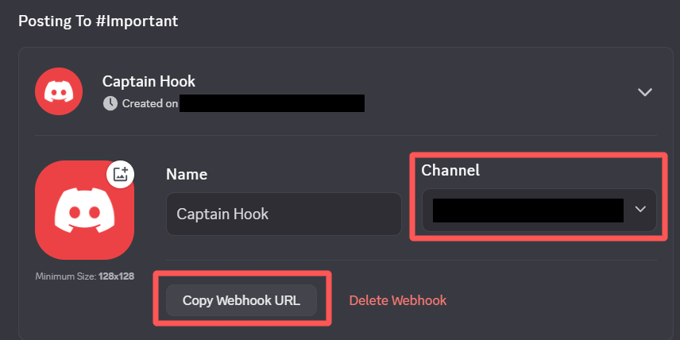
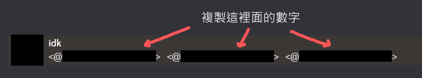

# GiCS 初賽哨兵 bot

## 2025 更新已發佈，請見 Release 頁面

這是一個被資安女婕思長達五天的初賽催生出的小工具

每三分鐘檢查隊伍每個人的土地數量，地數掉的時候播音樂、傳訊息通知，讓你的隊友可以安心睡覺 :sparkles:







- [安裝](#安裝)
- [使用](#使用)
    - [基本使用](#基本使用)
    - [進階使用](#進階使用)
    - [Discord 設定](#discord-設定)
- [注意事項](#注意事項)
- [Known Issues](#known-issues)
- [Todo](#todo)
- [Credits](#credits)

## 安裝
請用 [Python 3](https://www.python.org/downloads/) 以上

在 [Release 頁面](https://github.com/idkidkidkidkidkidkidkidk/gics-sentry-bot/releases/tag/v1.1) 下載 
gics_sentry_bot_v1.0.zip，解壓縮後執行指令，安裝需要的套件

```shell
pip install -r requirements.txt
```


## 使用
### 基本使用
```shell
# 測試音量
python alarm.py

# 在 .env 中填入競賽用的帳號密碼後再執行哨兵 bot
# 執行哨兵 bot
python sentry.py
```


### 進階使用
```shell
# 顯示所有選項
python sentry.py --help

# 更改警報會播放的 mp3 檔案
python sentry.py --music-path /path/to/your/alarm.mp3

# 設定程式異常時（例如網路斷線），不播放警報音樂
python sentry.py --silent-on-error

# 連接 Discord Webhook（需要額外設定）
python sentry.py --use-discord

# 關閉每小時透過 Discord Webhook 回報的功能
python sentry.py --no-hourly-report
```

### Discord 設定

Step 1. 在你有權限的 Discord 伺服器選擇 伺服器設定 > 整合





Step 2. 選擇 Webhook，然後點一下新 Webhook 按鈕




Step 3. 可以自行設定 bot 要傳訊息到哪個頻道，設定好後按 Copy Webhook URL，貼到 .env WEBHOOK_URL 後面




Step 4. 設定 bot 能提及隊友們，在一個隊友都在的伺服器依序輸入 \\@隊友帳號 後送出訊息，複製 <@[數字]> 中間的那一串數字，這是隊友們的使用者 ID

*如果有打開開發者模式，也可以右鍵隊友 > 複製使用者 ID*




Step 5. 把三個 ID 用逗號分隔，填到 .env 的 DISCORD_IDS 後面，不要加空白鍵


完成 :tada: 設定好後用 `python sentry.py --use-discord` 就能執行


## 注意事項
- 啟動 bot 之前請先使用 alarm.py 測試音量，避免太小聲或太大聲
- 建議檢查電腦在掛機一段時間後會不會休眠，休眠很可能導致哨兵 bot 停止運作


## Known Issues
1. 土地被打掉時才會告警，被攻擊但土地還沒被打掉時不會發出警報
2. 警報音樂播放時不會同時偵測攻擊


## Todo
- [ ] 大量重構
- [x] 警報音樂改成只播一分鐘，避免影響偵測
- [x] 替換警報時的動作，無縫接軌 Discord bot 等等

若有問題或想許願功能，歡迎開 Issue


## Credits
alarm.mp3 來源：Different Heaven - Nekozilla [NCS Release]

Music provided by NoCopyrightSounds

Free Download/Stream: http://ncs.io/nekozilla

Watch: http://youtu.be/6FNHe3kf8_s


Discord 截圖中的哨兵 bot 頭貼改自 [GiCS 競賽 logo](https://gics.tw/) 和 [Alert icons created by meaicon - Flaticon](https://www.flaticon.com/free-icons/alert)
